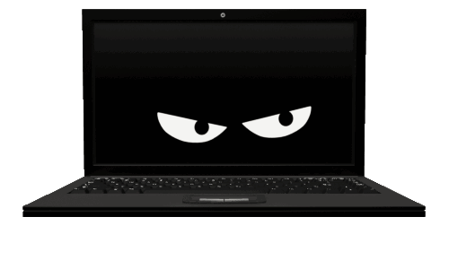

# CommandCam-Support-Scripts
A few support scripts which can be used to make CommandCam a `Swiss Knife`.

Take sanpshots of faces that start your laptop/PC.

###Requirements:

1. `CommandCam` - [Git Repo. Download Link](https://github.com/tedburke/CommandCam/blob/master/CommandCam.exe?raw=true)
2. `Startup.bat` - To Startup the application at Windows startup.
3. `Looper.bat` - To capture multiple snaps in a loop
4. `Invisible.vbs` - To make the execution of `Looper.bat` invisible.

#######Thanks to Ted Burke
